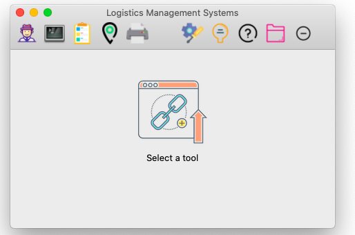

- [物流查询系统 mac环境开发](#-------mac----)
  * [项目介绍](#----)
  * [安装](#--)
  * [使用方法](#----)
  * [设计思路和原理](#-------)
  * [后续](#--)

# 物流查询系统 mac环境开发

## 项目介绍

​	本软件为《软件基础设计》综合课程设计作业，侧重算法与编译原理基础，不涉及网络编程。

**功能描述:**

- [x] 提供“物品”、“地图”、“运输“、“终端“、”打印“、”帮助“工具栏 
- [x]  通过“终端”工具，可以用 SQL 语句创建表，对记录进行增删查改。
- [x] 通过“物品”工具，实现增加物品信息，删除物品信息，更新物品信息功能
- [x] 通过“地图”工具，实现更新物品运输地点的更新
- [x] 通过“打印”工具，实现对城市信息以及物品信息的打印。
- [x] 帮助“工具给用户提供使用手册。

## 安装

下载到本地， 执行 `python main.py`

需要安装`GUI`依赖库` wxPython`

## 使用方法

工具栏

用户登录： 用户名和密码均为 `admin`

SQL模拟终端:

​	

​	

物品编辑：

地图信息：

​	

打印

​	打印物品信息和地图信息

物品排序和运输

​	

文件夹

## 设计思路和原理

**定义核心对象**

​		定义物品类，包含名称、发送地点、接收地点、联系人电话、是否加急配 送、到店日期、物流方案。还定义了一系列的物品方法——打印信息、获取相应 成员属性等方法。

​		定义城市类，其成员属性包含名称、与其他城市的时间与金钱成本、在该城 市的商品集合。声明的方法有打印城市信息、打印该城市的物品流信息、对物品 排序、计算当前城市到其他城市的最小代价路径、分配路径给物品。

​		定义地图类，包含所有城市的成本关系图，成员属性是两个成本图，成员方 法有计算最短路、打印表等。

**排序算法**

​	归并排序。虽然 Python 语言已经有快速排序算法，但作者想亲自实 现该算法，因为分而治之的思想在编程中非常重要，所以我实现了这个方法。排 序的标准在于商品的“是否加急”与“到店日期”两个属性。“加急的”优先于 “非加急”，其次“到店日期”早的优于晚的

**最短路算法采用 Dijkstra Shortest Path 算法。**

维护一个已被探索过的点集$ S$ 。 $S$ 中我们已经得到了从原点$ s$ 到点 $u$ 的最

短路径 $d(u)$.
 初始化时 $S={s},d(s)=0$. 重复选择未探索过的具有最小$π(v)$值的点$ v$

$$𝜋(𝑣)=min𝑑(𝑢)+𝑙- {e = (u,v)∶ u∈S}$$

下一个加入探索节点集的点 = 具有最小$π(v)$的点,假设为$ v’ $添加$ v’ $到$ S$, 并设置 $d(v’) =π(v’)$.

**数据保存**

1. 数据表的文件储存方式，文件储存多张数据表，数据存储多记录。指

   定记录储存、读写、记录简单查询与索引查询函数。

2. 单用户和进程对文件数据中记录的写入与查询

3. 数据表的文件储存方式采用标准的行标识文本储存

|   关键字    |         含义          |         格式          |
| :---------: | :-------------------: | :-------------------: |
| TABLE_BEGIN |         表头          |      TABLE_BEGIN      |
|    NAME     |        表名称         |    NAME:table_name    |
|    SIZE     |        行列数         | SIZE:line_cnt,col_cnt |
|    TYPE     | 列类型(字符串或整 数) |    TYPE:0 1 1 ...     |
|     COL     |        列名称         |  COL:name1 name2 ...  |
|  TABLE_END  |         表尾          |         TABLE         |

**SQL 解释器实现**

​	目标: 	解析 Mini-SQL 语句，包括 Select 语句、Insert 语句、Update 语句和 Create Table 语句。

1. 对接试验 2 中的数据库操作函数。
2. 构建语法解析器实现 Min-SQL 语句。
3. 构建语义解析器对 SQL 语句进行予以解析
4. 将予以解析的寓意对底层试实验 2 中实现的各个数据操作函数

UI 设计:

模仿 Linux 系统的 Terminal 软件实现 Mini-SQL 解释器的用户接口。

解释器实现:

1. 构建词法解析器，将SQL语句拆分成Token流。
2. 构建语法和语义解析器，让Token流进入语法解析器在对应的执行树 上执行，用语法制导翻译在语法树各个叶子结点处按语义规则递归返回结果，得到语义结构元祖(包含检验正确性结果、成功的调用函数命令和所需参数)

下面详细介绍 SQL 解释器的各关键模块的实现步骤

**词法构建** 

关键字

~~~
keywords = ["create","table","insert","into","display","select","where","update","fr om","set","values","and","all","int","string"]
~~~

词法解析器

​	词法分析器采用有限状态机的执行结构，对输入语句的字符逐个分析。有限 状态机在数学上可以等价于正则表达式，因此我直接使用正则表达式对输入语句 进行优雅地解析，效率高且代码简洁优雅。

文法设计

-  S -> CREATE_TABLE | ADD_LOG | SEARCH_LOG | DELETE_LOG| UPDATE_LOG
- CREATE_TALBLE -> create table ID ( COL_LIST );
- DATA_TYPE -> int|string
- COL_UNIT -> ID DATA_TYPE
- COL_LIST -> COL_UNIT|COL_UNIT,COL_LIST
- ADD_LOG -> insert into ID values ( VALUE_LIST )
- VALUE_LIST -> VALUE_UNIT|VALUE,VALUE_LIST l VALUE_UNIT -> NUM|STR
-  DISPLAY_TABLE -> display ID
- SEARCH_LOG -> select from ID where (FIND_LIST)
- FIND_LIST -> FIND_UNIT|FIND_UNIT,SEARCH_LIST
- FIND_UNIT -> ID CONDITION VALUE_UNIT
- CONDITION -> EQ|GET|LET|LT|RT
- UPDATE_LOG -> update ID set ID EQ VALUE_UNIT where ID EQ V ALUE_UNIT
- DELETE_LOG -> delete from ID where (FIND_LIST)

**语法解析器与语法制导翻译**

自顶向下递归解析，每一个节点对应的是相应的非终结符，叶子结点是终结 符。语法解析过程中采用语法制导翻译思想，进行语义分析，结束后递归向上返 回结果元祖。

分析 CREATE_TALBLE -> create table ID ( COL_LIST )。

定义 get_NON_type 函数为解析终结符 create、table、(、) 

定义 get_ID 函数解析标识符

定义 get_COLLIST 函数解析该单元。

定义 get_CREATE_TABLE 函数解析该单元

每个解析函数返回当前结点的结果，包括(检验正确性、错误结果、成功结 果的可选参数)。

**图形界面—— wxPython**

## 后续

加入多进程，多进程对单个文件某个表中的记录的互斥吸入与查询访问操作，一致性保证。

多用户对文件记录数据同时写入与查询的一致性操作。

添加网络模块。
